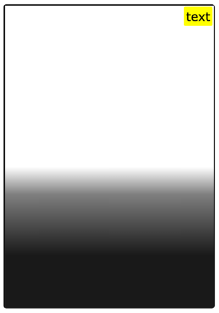

## Задание 1

Сделайте пожалуйста примерно блок как на рисунке (без градиента, однотонный).
Размер произвольный, пропорции примерно сохранены.
Рамка черная, толщиной 2px, цвета #000, скругление углов 5px.
В верхнем правом углу желтый блок с черным текстом.

## Дополнительное задание (*доп*)
Фон (backgroung) - градиент от белого в верху до черного внизу,
какой уж выйдет (не обязательно как на моем рисунке он должен выглядеть).
Как это сделать надо изутчить самостоятельно.

https://developer.mozilla.org/en-US/docs/Web/CSS/CSS_images/Using_CSS_gradients
